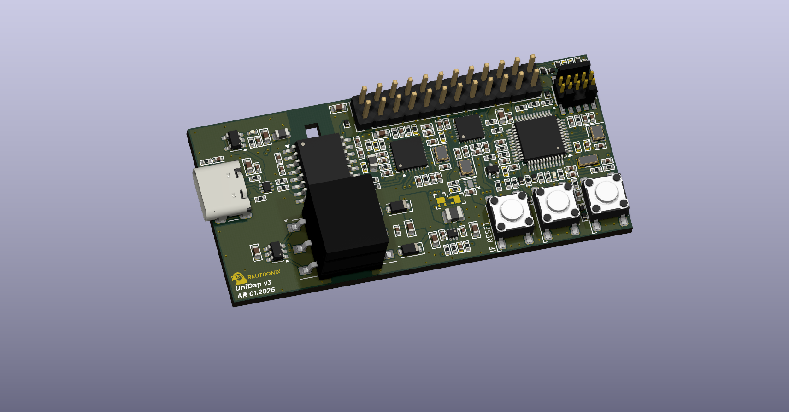
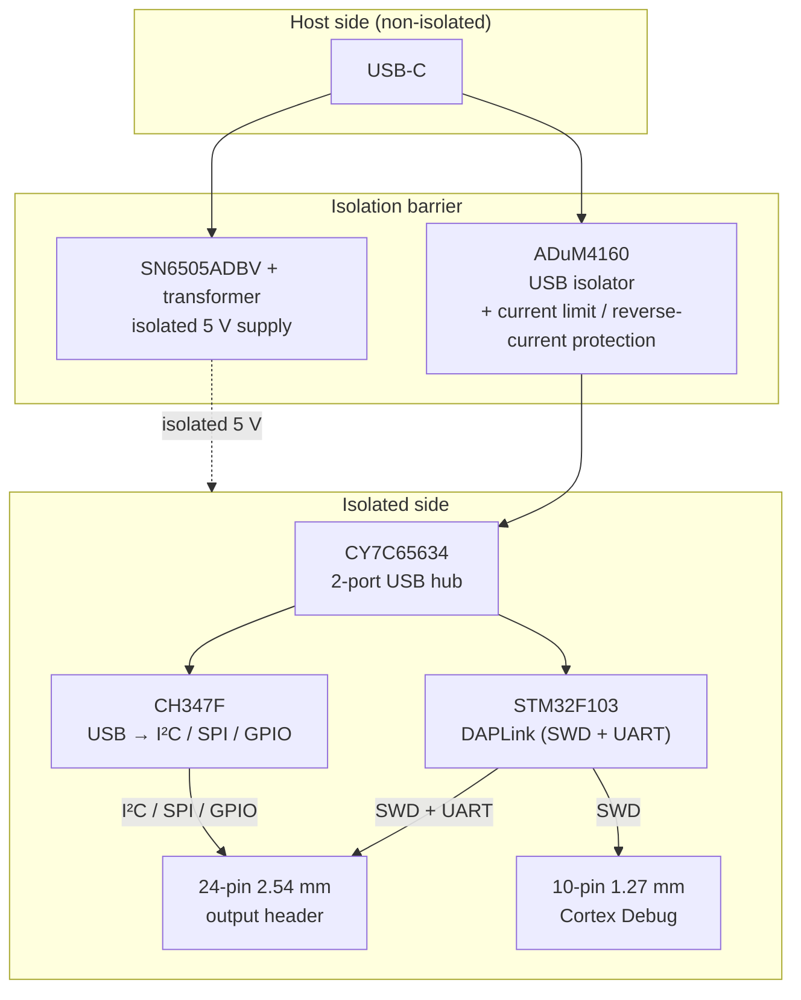

# UniDAP

**Galvanically isolated CMSIS-DAP debug probe with USB-to-I²C/SPI/GPIO bridging.**

UniDAP is an open hardware debug/programming probe. It combines a full USB-isolated CMSIS-DAP probe (SWD + UART) with a USB-to-I²C/SPI/GPIO bridge, so a single USB-C cable gives you target programming, a serial console, general-purpose bus access, and isolated power — all on the far side of a galvanic isolation barrier.

---

## Features

- **Full galvanic isolation** between the host USB and the target — data *and* power.
- **CMSIS-DAP / DAPLink probe** on an STM32F103 (SWD + virtual UART).
- **USB-to-I²C/SPI/GPIO bridge** via a WCH CH347F, exposed on the same output header.
- **Isolated power rails** to the target: 5 V, 3.3 V, and a **software-gated** power output.
- **Two SWD interfaces**: a 2.54 mm 24-position fan-out header and a standard 1.27 mm 10-pin ARM Cortex Debug box header.
- **Optional UART level shifter** referenced to the target supply.
- **Self-programmable**: the on-board STM32 can be flashed for the first time over the CH347, with no external tools.

---

## Architecture

A single USB-C connection is isolated for both data and power, then fanned out on the isolated side to the STM32 (DAPLink) and the CH347 through a 2-port USB hub.

### Key components

| Function | Part |
|---|---|
| Main MCU / debug probe | STM32F103 (running DAPLink) |
| USB → I²C / SPI / GPIO bridge | WCH CH347F |
| USB isolator | Analog Devices ADuM4160 |
| Isolated 5 V supply | TI SN6505ADBV push-pull transformer driver + transformer |
| USB hub (isolated side) | Cypress CY7C65634 (2-port) |
| Gated power output | ideal-diode switch, GPIO-controlled |
| UART level shifter (optional) | U502 (target-referenced) |

---

## Connectors & pinouts

### 24-pin 2.54 mm output header

The main fan-out header carries the SWD programming signals from the STM32, the DAPLink UART, the CH347 I²C/SPI/GPIO lines, and the isolated power rails (5 V, 3.3 V, and the gated `VOUT`). It uses an odd/even footprint: odd pins on one row, even pins on the other, with pin 1 and pin 2 side by side. Refer to on-board bottom side silkscreen.

| Pin | Signal | Group | | Pin | Signal | Group |
|----:|--------|-------|---|----:|--------|-------|
| 1 | GND | Ground | | 2 | 5V | Power |
| 3 | 3.3V | Power | | 4 | VOUT | Gated power |
| 5 | GPIO5 | GPIO | | 6 | GND | Ground |
| 7 | GND | Ground | | 8 | SCL | I²C |
| 9 | GPIO1 | GPIO | | 10 | SDA | I²C |
| 11 | SPI_SCK | SPI | | 12 | GPIO2 | GPIO |
| 13 | SPI_CS | SPI | | 14 | GND | Ground |
| 15 | SPI_MISO | SPI | | 16 | UART_TX | UART |
| 17 | SPI_MOSI | SPI | | 18 | UART_RX | UART |
| 19 | GPIO3 | GPIO | | 20 | GND | Ground |
| 21 | GND | Ground | | 22 | SWCLK | SWD |
| 23 | RESET | SWD | | 24 | SWDIO | SWD |

> **Note:** `VOUT` (pin 4) is the gated power output. In the standard configuration it is switched by CH347 **GPIO1** (pin 9) through the on-board ideal diode — see [Configuration](#configuration-jumpers--dnp-options). `RESET` (pin 23) is the target reset line.

### 10-pin 1.27 mm Cortex Debug header

Standard ARM Cortex Debug connector pinout — compatible with common SWD adapters and cables.

| Pin | Signal | Pin | Signal |
|----:|--------|----:|--------|
| 1 | VTREF | 2 | SWDIO / TMS |
| 3 | GND | 4 | SWCLK / TCK |
| 5 | GND | 6 | SWO / TDO |
| 7 | KEY (n/c) | 8 | NC / TDI |
| 9 | GNDDetect | 10 | nRESET |

### STM32 SWD programming pads (SMD)

Bare SMD pads are provided to program the STM32 over SWD directly (solder wires). Used mainly to recover a blank part or one without a USB bootloader. See [First-time STM32 programming](#first-time-stm32-programming).

---

## Configuration (jumpers & DNP options)

UniDAP ships in a **standard configuration**; several jumpers/footprints let you reconfigure it.

| Ref | Default | Function |
|---|---|---|
| **R501** | Populated | Routes CH347 **GPIO1** to the ideal-diode gate, so GPIO1 controls the **gated power output** (standard config). |
| **R502** | Unpopulated | Alternate route for CH347 GPIO1 to the main output header as a plain GPIO. **Populate R502 and remove R501** to expose GPIO1 on the header instead of driving the gated output. |
| **U502** | Unpopulated | Optional UART **level shifter**, supplied from the target voltage. |
| **R505 / R507** | Populated | Direct (unshifted) connection of the DAPLink UART to the output header. **Remove R505/R507 and populate U502** to route the UART through the level shifter. |

**Gated power output:** by default the isolated power to the target passes through an ideal-diode switch enabled by CH347 GPIO1, so power to the target can be switched under software control.

**Level-shifted UART:** in the standard configuration the DAPLink UART goes straight to the output header. Populating U502 (and removing R505/R507) shifts the UART to the target's logic level, referenced to the target supply.

---

## Firmware

The probe runs [DAPLink](https://github.com/ARMmbed/DAPLINK) (main branch).

- **Board ID:** `0080`
- **Provides:** CMSIS-DAP (SWD) + a virtual UART bridge.

### First-time STM32 programming

The STM32 can be programmed for the first time (or recovered when no USB bootloader is present) two ways:

1. **Over the CH347 (no external tools).** The CH347 UART0 is wired to the STM32 UART, and the STM32 **BOOT0** pin is driven by CH347 **GPIO0**. Asserting BOOT0 enters the STM32F103 system bootloader, and the firmware is flashed over UART. Use STM32CubeProgrammer to download the image.
2. **Over SWD.** Solder wires to the SWD SMD pads and flash with any CMSIS-DAP/ST-Link adapter.

---

## Acknowledgements

- [DAPLink](https://github.com/ARMmbed/DAPLINK) by Arm — the CMSIS-DAP firmware UniDAP is based on.
- WCH (CH347), Analog Devices (ADuM4160), TI (SN6505), Cypress/Infineon (CY7C65634).